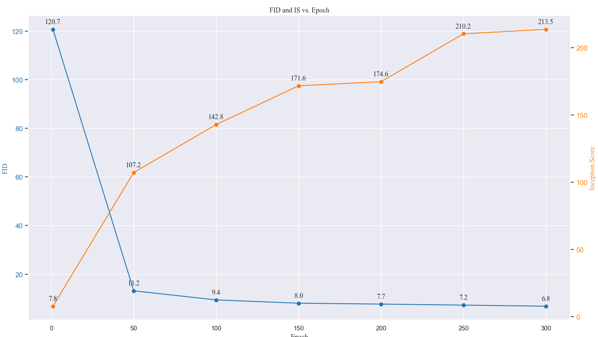
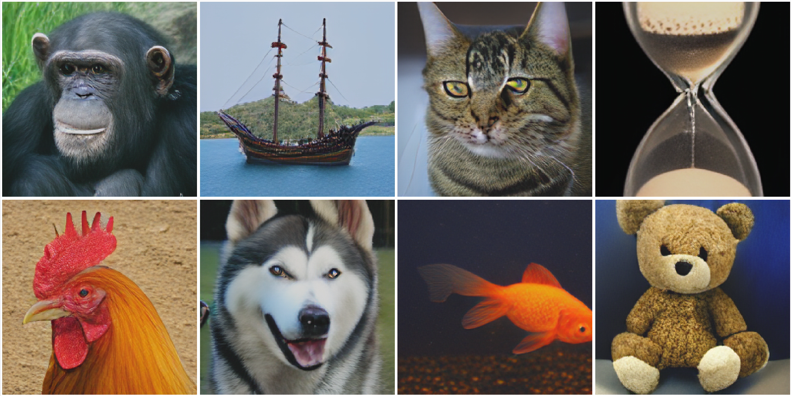
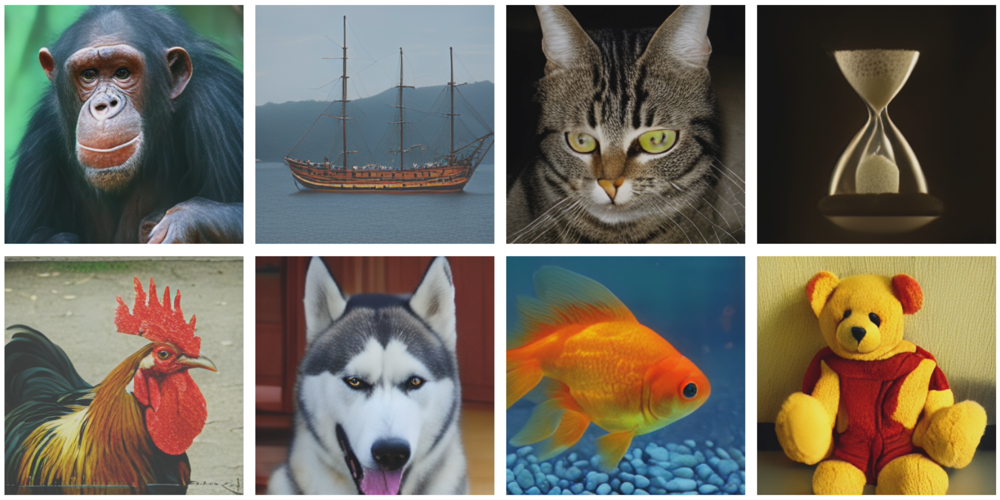
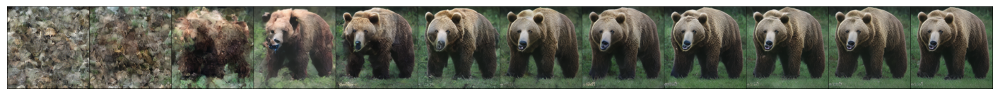
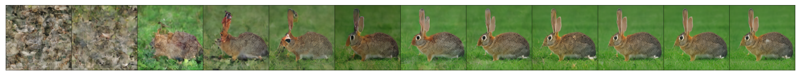
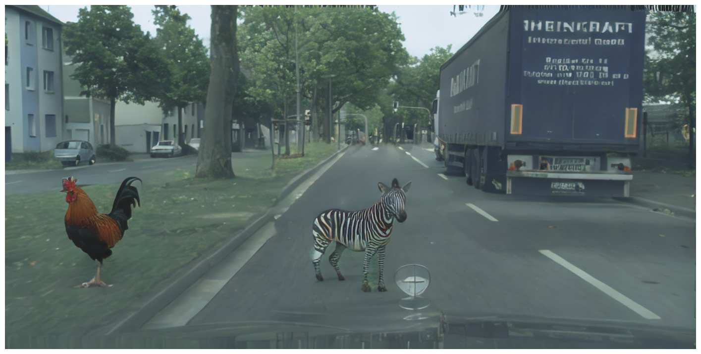

# MaskGIT PyTorch

[](https://github.com/llvictorll/MaskGIT-pytorch/stargazers)
[](https://colab.research.google.com/github/llvictorll/MaskGIT-pytorch/blob/main/colab_demo.ipynb)
[](LICENSE.txt)


Hi there! Welcome to the unofficial MaskGIT PyTorch repository. This project is inspired by the paper [MaskGIT: Masked Generative Image Transformer](https://arxiv.org/abs/2202.04200), and it aims to provide a PyTorch implementation and pretrained models for MaskGIT.

## Repository Structure

Here's an overview of the repository structure:
  
      ├ MaskGIT-pytorch/
      |    ├── Metrics/                               <- evaluation tool
      |    |      ├── inception_metrics.py                  
      |    |      └── sample_and_eval.py
      |    |    
      |    ├── Network/                             
      |    |      ├── Taming/                         <- VQGAN architecture   
      |    |      └── transformer.py                  <- Transformer architecture  
      |    |
      |    ├── Trainer/                               <- Main class for training
      |    |      ├── trainer.py                      <- Abstract trainer     
      |    |      └── vit.py                          <- Trainer of maskgit
      |    ├── save_img/                              <- Image samples         
      |    |
      |    ├── colab_demo.ipynb                       <- Inference demo 
      |    ├── LICENSE.txt                            <- MIT license
      |    ├── requirements.yaml                      <- help to install env 
      |    ├── README.md                              <- Me :) 
      |    └── main.py                                <- Main

## Usage

To get started with this project, follow these steps:

1. Clone the repository:

   ```bash
   git clone https://github.com/llvictorll/MaskGIT-pytorch.git
   cd MaskGIT-Pytorch

2. Install requirement 

   ```bash
   conda env create -f environment.yaml
   conda activate maskgit

3. (Opt.) Download Pretrained models  

   ```bash
   mkdir -p ckpt/MaskGIT/
   mkdir -p ckpt/VQGAN/
   # VQGAN
   gdown https://drive.google.com/uc?id=10pmySOtBrh8y3jKEa913vEuDR5KRauUt -O 'ckpt/VQGAN/'
   gdown https://drive.google.com/uc?id=10sQaqL70tsMze7RYJ7QkgPTVhGQrE9yf -O 'ckpt/VQGAN/'
   # MaskGIT 256
   gdown https://drive.google.com/uc?id=1vKm_69CNZYQvmHBy0azNcGYu8kMVeibg -O 'ckpt/MaskGIT/' 
   # MaskGIT 512
   gdown https://drive.google.com/uc?id=1SFGjkVZXE2k_gMM2DOCowncGoV6fKrjG-O 'ckpt/MaskGIT/' 
   
4. Launch training
   ```bash
   python main.py  --bsize ${bsize} --data-folder "${data_folder}" --vit-folder "${vit_folder}" --vqgan-folder "${vqgan_folder}" --writer-log "${writter_log}" --num_workers ${num_worker} --img-size 256 --epoch 300  

## Demo

You are interested only on inference of the model? You can run the demo_colab.ipynb in google collab! [](https://colab.research.google.com/github/llvictorll/MaskGIT-pytorch/blob/main/colab_demo.ipynb)

## Training Details

The model consists of a total of 246.303M parameters, with 174.161M for the transformer and 72.142M for VQGAN.
The VQGAN reduces a 256x256 (resp. 512x512) image to a 16x16 (resp. 32x32) token representation, over a bank of 1024 possible codes.
During the masked transformer training, I used a batch size of 512 over 300 epochs, leveraging 8 GPUs (~768 GPUs/hour on Nvidia A100) for ~750 000 iterations on ImageNet 256x256.
Then, I finetune the same model on ~750 000 iterations on ImageNet 512x512 with a bsize of 128 and ~384 GPUs/hour on Nvidia A100.

The transformer architecture hyperparameters:

| Hidden Dimension | Codebook Size | Depth | Attention Heads | MLP Dimension | Dropout Rate |
|------------------|---------------|-------|-----------------|---------------|--------------|
| 768              | 1024          | 24    | 16              | 3072          | 0.1          |

The optimizer employed is Adam with a learning rate of 1e-4, utilizing an 'arccos' scheduler for masking. Additionally, during training, I applied a 10% dropout for the CFG.

## Performance on ImageNet

Using the following hyperparameters for sampling:

| Image Size | Softmax Temp | Gumbel Temp | CFG (w) | Randomization | Schedule | Schedule Step |   
|------------|--------------|-------------|---------|---------------|----------|---------------|
| 256*256    | 1            | 4.5         | 3       | "linear"      | "arccos" | 8             |    
| 512*512    | 1            | 7           | 3       | "linear"      | "arccos" | 12            |    

I reach this performance on ImageNet:

| Metric                           | Ours 256*256 | Paper 256*256 | | Ours 512*512 | Paper 512*512 |
|----------------------------------|--------------|---------------|-|--------------|---------------|
| FID (Fréchet Inception Distance) | 6.80         | 6.18          | | 7.65         | 7.32          |
| IS (Inception Score)             | 214.0        | 182.1         | | 219.32       | 156.0         |
| Precision                        | 0.82         | 0.80          | | 0.83         | 0.78          |
| Recall                           | 0.51         | 0.51          | | 0.48         | 0.50          |
| Density                          | 1.25         | -             | | 1.27         | -             | 
| Coverage                         | 0.84         | -             | | 0.84         | -             |

The IS rises monotonically along the training while the FID decrease:



For visualization, to boost the image quality, I increase the amount of steps (32) the softmax temperature (1.3) and the cfg weight (9) to trade diversity for fidelity
###  Performance on ImageNet 256


### Performance on ImageNet 512


And generation process:



## Inpainting
The model demonstrates good capabilities in inpainting ImageNet-generated images into scenes:


## Pretrained Model

You can download the pretrained MaskGIT models in the release of the code.

## Contribute

The reproduction process might encounter bugs or issues, or there could be mistakes on my part. If you're interested in collaborating or have suggestions, please feel free to reach out (by [creating an issue](https://github.com/llvictorll/MaskGIT-pytorch/issues/new)). Your input and collaboration are highly valued!

## License

This project is licensed under the MIT License. See the [LICENSE](LICENSE.txt) file for details.

## Acknowledgement

This project is powered by IT4I Karolina Cluster locate in the Czech Republic. 

The pretrained VQGAN ImageNet (f=16), 1024 codebook. The implementation and the pre-trained model is coming from the [official repository](https://github.com/CompVis/taming-transformers/tree/master)
